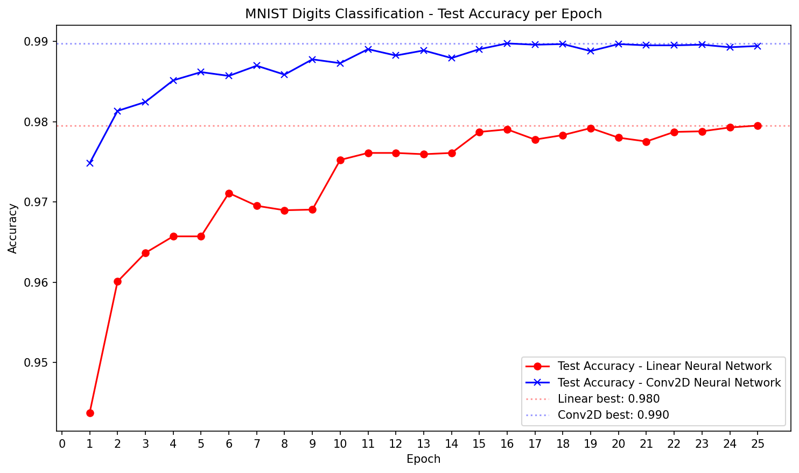

# Comparing Difference Between Linear and Conv2D Neural Networks of digitsMNIST

## Context
Data found on KaggleHub: "MNIST Digit Recognizer" by ANIMATRONBOT. Found Here: https://www.kaggle.com/datasets/animatronbot/mnist-digit-recognizer

Supervised learning of 42,000 samples of 784 features. Features are pixels in a 28x28 grid that make a black and white image of a digit (0-9).

### Pytorch Models
- Fully connected MLP (784 → 512 → 512 → 10)
- CNN using 2 layers of Conv2D and 1 of Linear (Conv2D(1,16) -> Conv2D(16,32) -> 32*7*7 -> 256 -> 10)

## Libraries
matplotlib, numpy, pandas, pytorch, scikit-learn

## Process
### model_functions.py
- Create a Neural Network that flattens the data and puts it through 2 hidden layers with 512 node. Using ReLU as the activation function. 512 nodes chosen due to balance between accuracy and computational cost
- Conv2D Neural Network made that used 2 layers of 16 and 32 Conv2D, 1 layer of Linear used at 256 for easy processing.
- Dropout used to minimize chance of overfitting by randomly deactivating neurons so model is forced to learn redundant representations
- Training loop created where data is inputted into the neural network, loss is calculated and stored in loss function and then optimized.
- Test loop created where loss and accuracy is measured during each epoch. Total loss and accuracy is then printed.
### main.py
- Transform data into a pytorch tensor.
- Split data into training and testing data and put into data loader.
- Cross Entropy Loss used for simplicity and effective multi-class classification.
- Adam optimizer chosen for its adaptive learning rate and strong general performance on neural networks.
- ReduceLROnPlateau used as scheduler to increase accuracy by reducing learning rate, leading to better backpropagation
- Epoch loop created for training and testing data on both Linear and Conv2D.
- Accuracies graphed for easier comparison. 

## Final Results

   
  Figure 1. Graph showing accuracy comparison per epoch of Linear and Conv2D Models.

The Conv2D model shows a better accuracy over the Linear model per epoch. Conv2D also shows a higher max accuracy of 99.0%, 1 percentage point higher than the Linear model's 98.0%.

| Model     | Best Accuracy | Training Time | Epochs to 97.5% |
|-----------|---------------|---------------|---------------|
| Linear NN | 98.0%         | 34.1s         | ~11           |
| Conv2D    | 99.0%         | 100.2s        | ~6            |

*Figure 2. Table comparing accuracy, time, and epochs to 97% of both models.

Conv2D also converges faster — reaching 97% accuracy by epoch 6 versus epoch 11 for Linear, suggesting convolutional layers extract 
spatial features more efficiently than fully connected layers on image data.

However, the Conv2D model takes almost 3 times as long. While Conv2D is more accurate, more time is required for that accuracy.

## Application of Findings
### Conv2D
- Slower model more fit for understanding images
- Much more accurate for understanding 2d images
- More likely to be used in services that require high accuracy or cannot afford to be wrong: security systems, autonomous vehicles, and healthcare.
### Linear
- Faster than Conv2D counterpart, but less reliable in understanding images
- More likely to be used in services that require quick but less accurate data like: retail check-out, quick barcode scanning, and social media recommendations.

## Future work and Limitations
- Only 2 hidden layers of 512 node used for linear model due to memory and cpu limitations. More nodes or layers may increase accuracy
- Only 2 Conv2D layers used due to memory and cpu limitations. More layers could increase accuracy at cost of time.
- Learning rate scheduler was used but not tuned precisely. More parameter tuning could lead to higher accuracies.
